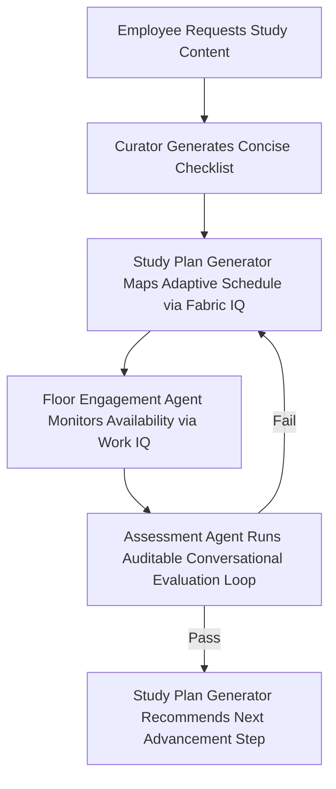

# ManuTech AI: Autonomous Multi-Agent Enterprise Learning Platform for Factories and Warehouses

[](https://ai.azure.com)
[](https://modelcontextprotocol.io)
[](https://opensource.org/licenses/Apache-2.0)

ManuTech AI is an enterprise-grade multi-agent orchestration platform engineered to modernize frontline workforce upskilling, continuous compliance certification, and automated ESG reporting. Specially designed for the high-throughput, unpredictable environment of **AFriGlow** (an FMCG manufacturing plant in Aba, Abia State), this architecture dynamically fits training into daily production cycles without introducing operational downtime or disrupting factory floor focus windows.

---

## 📊 Synthetic Data Notice
> [!IMPORTANT]  
> **Compliance & Privacy:** All organizational matrices, employee profiles, identifiers, shift schedules, and operational logs used throughout this repository and demonstration are **100% synthetically generated**. No real-world personnel data or confidential corporate records were used or exposed in this project.

---

## 🛠️ Architecture Overview

The platform operates as a context-aware multi-agent fleet grounded via **Azure AI Foundry**, combining real-time workforce infrastructure with official enterprise documentation to execute decentralized, workload-optimized training workflows.


```
┌──────────────────────────────┐
│   ManuTech AI Coordinator    │
└──────────────┬───────────────┘
│
┌───────────────────────┼───────────────────────┐
▼                       ▼                       ▼
┌─────────────────┐     ┌─────────────────┐     ┌─────────────────┐
│   Work IQ MCP   │     │  Fabric IQ MCP  │     │Assessment Agent │
│  (Engagement)   │     │ (Study Planner) │     │  (Auditable KB) │
└─────────────────┘     └─────────────────┘     └─────────────────┘
```

### Core Agents & Ecosystem Components

1. **ManuTech AI Coordinator:** The foundational central orchestrator handling intent routing, session handoffs, and UI interaction hooks.
2. **Floor Engagement Agent (Work IQ MCP):** Configured via the Microsoft Work IQ endpoint (`https://workiq.svc.cloud.microsoft/mcp`) to monitor factory floor focus windows, shift changes, and team capacities. It delivers proactive, low-friction outreach during natural lulls.
3. **Study Plan Generator Agent (Fabric IQ MCP):** Backed by the official production Fabric Core MCP Server (`https://api.fabric.microsoft.com/v1/mcp/core`). It hooks directly into the semantic layer to map certification tracks, evaluate prerequisites, and generate workload-adaptive training schedules.
4. **Auditable Assessment Agent:** A specialized knowledge source and agent pipeline running a strict conversational verification loop. It validates student readiness with mandatory source documentation citations (`[Source Document, Section/Page]`).
5. **Learning Path Curator:** An upstream data layer that aggregates the underlying educational facts, safety protocols, and ESG compliance structures.
6. **AFriGlow Employee Knowledge Base (`afriglow-employee-knowledge-base`):** Configured in **Extractive Data** mode to securely parse localized tabular schemas (Synthetic Employee IDs, operational roles, shift rosters, and real-time workload states).

---

## ⚙️ Orchestration & Baseline Flow

The system runs a closed-loop multi-agent workflow to move personnel from gap identification to full certification compliance:


 1. **Tailoring:** When an employee specifies a topic, the learning-path-curator generates a concise conceptual checklist tailored to their goals.
 2. **Scheduling:** The study-plan-generator processes the workload capacity and uses the Fabric semantic model to output a practical, role-adapted study schedule.
 3. **Outreach:** The floor-engagement-agent monitors real-time availability via Work IQ, sending punchy, sub-two-sentence compliance lessons that can be seamlessly deferred during production surges.
 4. **Evaluation:** The assessment-agent executes conversational grading using grounded questions, validating student proficiency before logging completions.
 5. **Reporting:** Managers gain unified pipeline visibility into team learning progress and exam readiness risks by querying designated boundaries on the learning-path-curator and study-plan-generator.
## 💻 Local Setup & Deployment
Follow these quick steps to clone the repository and deploy the architecture directly to your Azure environment.
### 1. Clone the Repository
```bash
git clone [https://github.com/Larrychi101/ManuTech-AI.git](https://github.com/Larrychi101/ManuTech-AI.git)
cd ManuTech-AI

```
### 2. Create a Virtual Environment
```bash
# Windows
python -m venv .venv
.venv\Scripts\activate

# macOS/Linux
python3 -m venv .venv
source .venv/bin/activate

```
### 3. Deploy to Azure with azd
This project utilizes the **Azure Developer CLI (azd)** to automatically provision all required services (Azure AI Foundry, endpoints, etc.) and deploy the multi-agent setup in one go.
```bash
# Log in to your Azure account
azd auth login

# Initialize and spin up the infrastructure
azd up

```
## ⚙️ Portal Configuration Matrix
Once deployed via azd, verify that your agent properties and knowledge bases match the following operational criteria:
### 1. Main System Instructions
Set the system prompt to enforce distinct multi-agent boundaries:
 * **Checklist Pre-Execution:** Force agents to outline conceptual sequences before tool execution.
 * **Tool Isolation:** Restrict workload-adapted study plans to the study-plan-generator and employee lookups strictly to the afriglow-employee-knowledge-base.
 * **Zero-Hallucination:** Mandate an explicit "I don't know" fallback if a response is missing from the underlying knowledge base tools.
### 2. Knowledge Source Routings
 * **afriglow-employee-knowledge-base Properties:** Enforce **Extractive Data** mode. Set reasoning effort to **High**.
 * **Knowledge Base Retrieval Instructions:**
```text
    Prioritize 'Work_IQ_Context' to determine worker availability, task load, and communication rhythm before initiating any interaction. Once availability is confirmed, query 'ESG_Certification_Modules' to identify the current learning objective. If a worker indicates an issue or asks about operational status, prioritize 'Floor_SOPs' for accurate guidance. Only query general company knowledge if the inquiry falls outside of these operational, educational, and safety contexts.
    ```

---

## 🛡️ License
Distributed under the Apache License 2.0. See `LICENSE` for more information. Built for the **Microsoft Agents League Hackathon (June 2026)**.
