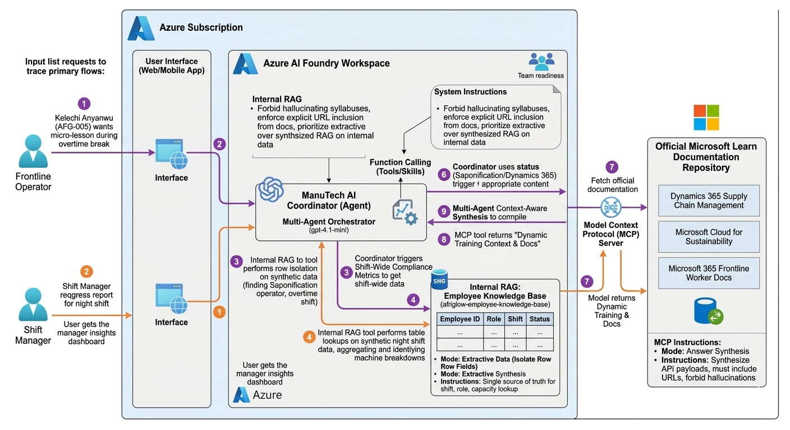

# ManuTech AI: Autonomous Multi-Agent Enterprise Learning Platform

[](https://ai.azure.com)
[](https://modelcontextprotocol.io)
[](https://opensource.org/licenses/Apache-2.0)

ManuTech AI is a multi-agent orchestration architecture designed to modernize frontline workforce upskilling, continuous compliance certification, and automated ESG reporting. Engineered for the high-throughput, unpredictable environment of manufacturing plants, this platform dynamically fits training into daily production cycles without introducing operational downtime.

---

## 📊 Synthetic Data Notice
> [!IMPORTANT]  
> **Compliance & Privacy:** All organizational matrices, employee profiles, identifiers, shift schedules, and operational logs used throughout this repository and demonstration are **100% synthetically generated**. No real-world personnel data or confidential corporate records were used or exposed in this project.

---

## 🛠️ Architecture Overview



The platform operates as a context-aware multi-agent fleet grounded via **Azure AI Foundry**, combining internal personnel metrics with official enterprise documentation to deliver real-time, workload-optimized training workflows.

### Core Agents & Components

1. **ManuTech AI Coordinator:** The foundational orchestrator handling intent routing, session handoffs, and UI interaction hooks.
2. **Knowledge Base Grounding (`afriglow-employee-knowledge-base`):** Configured in **Extractive Data** mode to securely parse localized tabular schemas (Synthetic Employee IDs, operational roles, shift rosters, and real-time workload states) to ensure hallucination-free decision-making.
3. **Upstream Documentation Router (`learning-path-curator`):** Backed by the **Model Context Protocol (MCP)** server pointing natively to the production Microsoft Learn documentation repository (`https://learn.microsoft.com/api/mcp`) to fetch data on systems like *Dynamics 365 Supply Chain Management* and *Microsoft Cloud for Sustainability*.

---

## 💻 Local Setup & Deployment

Follow these quick steps to clone the repository and deploy the architecture directly to your Azure environment.

### 1. Clone the Repository
```bash
git clone [https://github.com/Larrychi101/ManuTech-AI.git](https://github.com/Larrychi101/ManuTech-AI.git)
cd ManuTech-AI

```
### 2. Create a Virtual Environment
```bash
# Windows
python -m venv .venv
.venv\Scripts\activate

# macOS/Linux
python3 -m venv .venv
source .venv/bin/activate

```
### 3. Deploy to Azure with azd
This project utilizes the **Azure Developer CLI (azd)** to automatically provision all required services (Azure AI Foundry, endpoints, etc.) and deploy the multi-agent setup in one go.
```bash
# Log in to your Azure account
azd auth login

# Initialize and spin up the infrastructure
azd up

```
## ⚙️ Portal Configuration
Once deployed via azd, ensure your agent and knowledge base properties in the Azure AI Foundry portal are configured as follows:
 * **Display Name:** ManuTech AI Coordinator
 * **Description:** An autonomous floor assistant that fits training into a factory worker's busy shift and gives managers real-time visibility into team compliance.
 * **Model Tier:** gpt-4.1-mini
 * **Retrieval Instructions (afriglow-employee-knowledge-base):** Enforce Extractive data mode. Instruct the agent to treat the table as the single source of truth for shift, role, and capacity lookup.
 * **Answer Instructions (learning-path-curator):** Enforce Answer synthesis mode. Command the agent to always include direct URLs to official Microsoft Learn documentation and strictly forbid hallucinating course syllabus maps.
## 🛡️ License
Distributed under the Apache License 2.0. See LICENSE for more information. Built for the **Microsoft Agents League Hackathon (June 2026)**.
